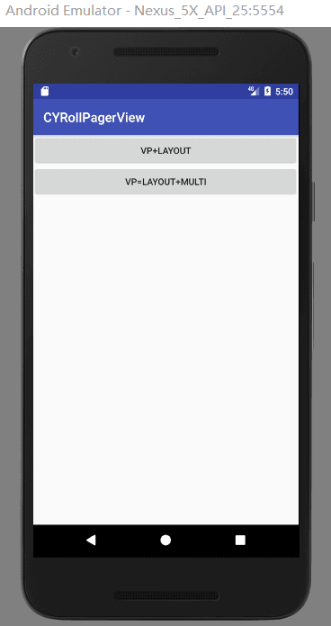

[简书](https://www.jianshu.com/p/4ec14695c2d7)

[APK](https://github.com/AnJiaoDe/LoopViewPager/blob/master/app/build/outputs/apk/app-debug.apk)

如有任何问题或者是建议，可以QQ群:安娇德IT技术交流群757173381讨论，开源库会根据需求持续更新。

**使用方法**

将libray模块复制到项目中,或者直接在build.gradle中依赖:

```
allprojects {
		repositories {
			...
			maven { url 'https://jitpack.io' }
		}
	}
```

```
dependencies {
	        compile 'com.github.AnJiaoDe:LoopViewPager:V1.1.2'
	}
```

**注意：如果sync报错，是因为和com.android.tools.build:gradle 3.0有关，**
**可以改将compile改为implementation 或者api** 
**1.VP+Layout**


```
<?xml version="1.0" encoding="utf-8"?>
<com.cy.rollpagerview.CYRollPagerView xmlns:android="http://schemas.android.com/apk/res/android"
    xmlns:tools="http://schemas.android.com/tools"
    android:id="@+id/vp"
    android:layout_width="match_parent"
    android:layout_height="400dp">

</com.cy.rollpagerview.CYRollPagerView>

```

```


public class VPLayoutActivity extends BaseActivity {
    private CYLoopPagerAdapter<VPBean> cyLoopPagerAdapter;
    private CYRollPagerView<VPBean> cyRollPagerView;
    @Override
    protected void onCreate(Bundle savedInstanceState) {
        super.onCreate(savedInstanceState);
        setContentView(R.layout.activity_vplayout);
        List<VPBean> list=new ArrayList<>();

        list.add(new VPBean("https://timgsa.baidu.com/timg?image&quality=80&size=b9999_10000&sec=1523860722694&di=6671f0dd55b6b164a096fc52145b75a6&imgtype=0&src=http%3A%2F%2Fc.hiphotos.baidu.com%2Fbaike%2Fpic%2Fitem%2Fd009b3de9c82d158b62f49ef890a19d8bc3e423a.jpg",
                "添加hi偶就能够"));
        list.add(new VPBean("https://ss3.bdstatic.com/70cFv8Sh_Q1YnxGkpoWK1HF6hhy/it/u=2777350900,2402717967&fm=27&gp=0.jpg",
                "德国人和"));
        list.add(new VPBean("https://ss0.bdstatic.com/70cFuHSh_Q1YnxGkpoWK1HF6hhy/it/u=2666040239,1399277915&fm=27&gp=0.jpg",
                "如果和认同和"));
        list.add(new VPBean("https://ss1.bdstatic.com/70cFuXSh_Q1YnxGkpoWK1HF6hhy/it/u=2341746217,231983218&fm=11&gp=0.jpg",
                "人皇太后"));
        list.add(new VPBean("https://ss0.bdstatic.com/70cFuHSh_Q1YnxGkpoWK1HF6hhy/it/u=2469049613,2268261369&fm=27&gp=0.jpg",
                "而天花板"));

        cyRollPagerView= (CYRollPagerView<VPBean>) findViewById(R.id.vp);

        cyLoopPagerAdapter=new CYLoopPagerAdapter<VPBean>(cyRollPagerView,list) {


            @Override
            public void bindDataToView(ViewHolder holder, int position, VPBean bean) {


                holder.setImage(R.id.iv,bean.getUrl(),1080,500);
                holder.setText(R.id.tv,bean.getText());
            }


            @Override
            public int getItemLayoutID(int position, VPBean bean) {
                return R.layout.item_layout;
            }
            @Override
            public void onItemClick(int position, VPBean bean) {

            }
        };

        cyRollPagerView.setAdapter(cyLoopPagerAdapter,3000,new CYColorPointHintView(this));
    }

    @Override
    public void onClick(View v) {

    }
}

```

**2.VP+Layout+Multi**



```
<?xml version="1.0" encoding="utf-8"?>
<com.cy.rollpagerview.CYRollPagerView xmlns:android="http://schemas.android.com/apk/res/android"
    xmlns:tools="http://schemas.android.com/tools"
    android:id="@+id/vp"
    android:layout_width="match_parent"
    android:layout_height="400dp">

</com.cy.rollpagerview.CYRollPagerView>

```

```

public class VPLayoutMultiActivity extends BaseActivity {

    private CYLoopPagerAdapter<VPBean> cyLoopPagerAdapter;
    private CYRollPagerView<VPBean> cyRollPagerView;
    @Override
    protected void onCreate(Bundle savedInstanceState) {
        super.onCreate(savedInstanceState);
        setContentView(R.layout.activity_vplayout_multi);
        List<VPBean> list=new ArrayList<>();

        list.add(new VPBean("https://timgsa.baidu.com/timg?image&quality=80&size=b9999_10000&sec=1523860722694&di=6671f0dd55b6b164a096fc52145b75a6&imgtype=0&src=http%3A%2F%2Fc.hiphotos.baidu.com%2Fbaike%2Fpic%2Fitem%2Fd009b3de9c82d158b62f49ef890a19d8bc3e423a.jpg",
                "添加hi偶就能够"));
        list.add(new VPBean("https://ss3.bdstatic.com/70cFv8Sh_Q1YnxGkpoWK1HF6hhy/it/u=2777350900,2402717967&fm=27&gp=0.jpg",
                "德国人和"));
        list.add(new VPBean("https://ss0.bdstatic.com/70cFuHSh_Q1YnxGkpoWK1HF6hhy/it/u=2666040239,1399277915&fm=27&gp=0.jpg",
                "如果和认同和"));
        list.add(new VPBean("https://ss1.bdstatic.com/70cFuXSh_Q1YnxGkpoWK1HF6hhy/it/u=2341746217,231983218&fm=11&gp=0.jpg",
                "人皇太后"));
        list.add(new VPBean("https://ss0.bdstatic.com/70cFuHSh_Q1YnxGkpoWK1HF6hhy/it/u=2469049613,2268261369&fm=27&gp=0.jpg",
                "而天花板"));

        cyRollPagerView= (CYRollPagerView<VPBean>) findViewById(R.id.vp);

        cyLoopPagerAdapter=new CYLoopPagerAdapter<VPBean>(cyRollPagerView,list) {


            @Override
            public void bindDataToView(ViewHolder holder, int position, VPBean bean) {


                holder.setImage(R.id.iv,bean.getUrl(),1080,500);
                holder.setText(R.id.tv,bean.getText());
            }


            @Override
            public int getItemLayoutID(int position, VPBean bean) {

                if (position==0||position==3){
                    return R.layout.item_layout2;
                }
                return R.layout.item_layout;
            }
            @Override
            public void onItemClick(int position, VPBean bean) {

            }
        };

        cyRollPagerView.setAdapter(cyLoopPagerAdapter,new CYColorPointHintView(
                this,0xffff0000,0xffffffff,8,8,4));
    }

    @Override
    public void onClick(View v) {

    }
}

```
  **CYLoopPagerAdapter**

```


public abstract class CYLoopPagerAdapter<T> extends LoopPagerAdapter {
    private List<T> list_bean;

    public CYLoopPagerAdapter(RollPagerView viewPager) {
        super(viewPager);
    }

    public CYLoopPagerAdapter(RollPagerView viewPager, List<T> list_bean) {
        super(viewPager);
        this.list_bean = list_bean;
    }

    @Override
    public View getView(ViewGroup container, final int position) {

        View view=LayoutInflater.from(container.getContext()).inflate
                (getItemLayoutID(position,list_bean.get(position)), container, false);

        view.setOnClickListener(new View.OnClickListener() {
            @Override
            public void onClick(View v) {
                onItemClick(position,list_bean.get(position));
            }
        });
        bindDataToView(new ViewHolder(view),position,list_bean.get(position));
        return view;

    }

    @Override
    protected int getRealCount() {
        return list_bean.size();
    }
    //填充数据
    public abstract void bindDataToView(ViewHolder holder, int position, T bean);
    /*
         取得ItemView的布局文件
         @return
        */
    public abstract int getItemLayoutID(int position, T bean);
     /*
      ItemView的单击事件

      @param position
     */

    public abstract void onItemClick(int position, T bean);

    public int addAll(List<T> beans) {
        list_bean.addAll(beans);

        notifyDataSetChanged();
        return beans.size();
    }
    public int clearAddAll(List<T> beans) {
        list_bean.clear();
        list_bean.addAll(beans);

        notifyDataSetChanged();
        return beans.size();
    }

    public static class ViewHolder {
        private View itemView;
        private SparseArray<View> array_view;

        public ViewHolder(View itemView) {
            this.itemView = itemView;

            array_view = new SparseArray<View>();

        }


        public <T extends View> T getView(int viewId) {

            View view = array_view.get(viewId);
            if (view == null) {
                view = itemView.findViewById(viewId);
                array_view.put(viewId, view);
            }
            return (T) view;
        }


        public ViewHolder setVisible(int res_id) {
            getView(res_id).setVisibility(View.VISIBLE);
            return this;
        }

        public ViewHolder setInVisible(int res_id) {
            getView(res_id).setVisibility(View.INVISIBLE);
            return this;
        }

        public void setViewGone(int res_id) {
            getView(res_id).setVisibility(View.GONE);
        }

        public void setViewVisible(int res_id) {
            getView(res_id).setVisibility(View.VISIBLE);
        }


        public void setText(int tv_id, String text) {
            TextView tv = getView(tv_id);


            tv.setText(nullToString(text));
        }

        public String nullToString(Object object) {
            return object == null ? "" : object.toString();
        }

        public void setPriceText(int tv_id, String text) {
            TextView tv = getView(tv_id);

            tv.setText("¥" + text);
        }

        public void setCountText(int tv_id, String text) {
            TextView tv = getView(tv_id);

            tv.setText("x" + text);
        }

        public void setCountText(int tv_id, int text) {
            TextView tv = getView(tv_id);

            tv.setText("x" + text);
        }

        public void setPriceText(int tv_id, int text) {
            TextView tv = getView(tv_id);

            tv.setText("¥" + text);
        }

        public void setPriceText(int tv_id, float text) {
            TextView tv = getView(tv_id);

            tv.setText("¥" + text);
        }

        public void setText(int tv_id, int text) {
            TextView tv = getView(tv_id);
            tv.setText(String.valueOf(nullToString(text)));
        }

        public void setTextColor(int tv_id, int color) {
            TextView tv = getView(tv_id);
            tv.setTextColor(color);
        }

        public String getTVText(int tv_id) {
            TextView tv = getView(tv_id);
            return tv.getText().toString().trim();
        }

        public String getETText(int tv_id) {
            EditText tv = getView(tv_id);
            return tv.getText().toString().trim();
        }

        public void setBackgroundResource(int v_id, int resid) {
            View view = getView(v_id);
            view.setBackgroundResource(resid);
        }

        public void setImageBitmap(int v_id, Bitmap bitmap) {
            ImageView view = getView(v_id);
            view.setImageBitmap(bitmap);
        }

        public void setImageResource(int v_id, int resID) {
            ImageView view = getView(v_id);
            view.setImageResource(resID);
        }

        public void setProgress(int progress_id, int progress) {
            ProgressBar progressBar = getView(progress_id);
            progressBar.setProgress(progress);

        }


        public void setImage( int iv_id, String url) {
            ImageView iv = getView(iv_id);

            GlideUtils.loadImageByGlide(itemView.getContext(), url, iv);
        }
        public void setImage( int iv_id, String url, int width,int height) {
            ImageView iv = getView(iv_id);

            GlideUtils.loadImageByGlide(itemView.getContext(), url, iv, width,height);
        }
        public void setOnClickListener(int res_id, View.OnClickListener onClickListener) {
            getView(res_id).setOnClickListener(onClickListener);
        }

        public void setOnLongClickListener(int res_id, View.OnLongClickListener onLongClickListener) {
            getView(res_id).setOnLongClickListener(onLongClickListener);
        }

    }
}

```
 参考：[Android ViewPager](https://blog.csdn.net/confusing_awakening/article/category/6994047)
 
 
 **更新日志**
 
 *V1.1.1*
  - Android ViewPager无限自动轮播开源库（多布局、自定义HintView）
  
  

**License**

 Copyright [AnJiaoDe] [name of copyright owner]

   Licensed under the Apache License, Version 2.0 (the "License");
   you may not use this file except in compliance with the License.
   You may obtain a copy of the License at

       http://www.apache.org/licenses/LICENSE-2.0

   Unless required by applicable law or agreed to in writing, software
   distributed under the License is distributed on an "AS IS" BASIS,
   WITHOUT WARRANTIES OR CONDITIONS OF ANY KIND, either express or implied.
   See the License for the specific language governing permissions and
   limitations under the License.
   
   
   [GitHub](https://github.com/AnJiaoDe)

关注专题[Android开发常用开源库](https://www.jianshu.com/c/3ff4b3951dc5)

[简书](https://www.jianshu.com/u/b8159d455c69)

 微信公众号
 

QQ群


 
